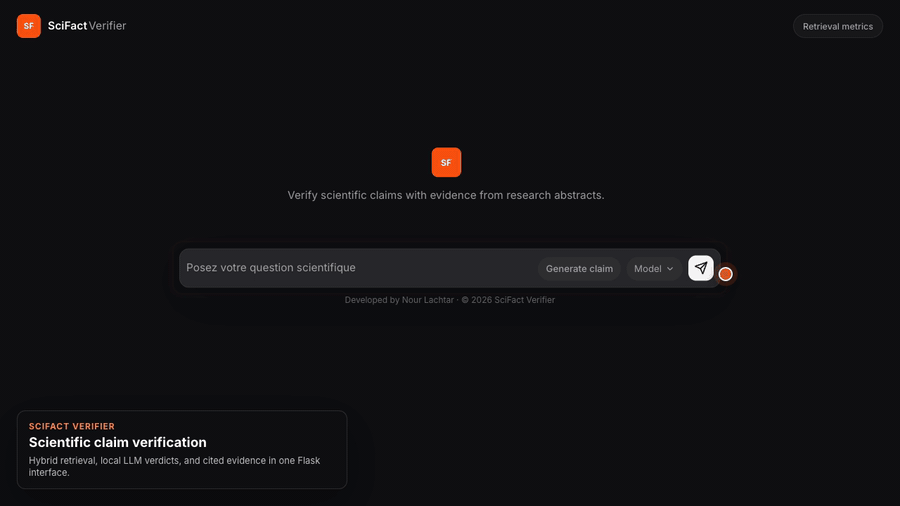

# SciFact RAG Verifier

SciFact RAG Verifier is a research prototype for scientific claim verification on the [SciFact](https://allenai.org/data/scifact) dataset.

The project combines classical information retrieval, dense scientific embeddings, reranking, and local LLM generation to verify biomedical claims against retrieved abstracts.

```text
SUPPORTED / REFUTED / NOT ENOUGH INFO
```

## Demo



## Project Status

Implemented:

- Flask web interface for entering and verifying scientific claims
- Retrieval-only and full RAG API endpoints
- BM25 lexical retrieval
- SPECTER2 dense retrieval with FAISS
- Hybrid retrieval with Reciprocal Rank Fusion
- Cross-encoder reranking option
- Local LLM verdict generation through Ollama
- Retrieval metrics dashboard in the UI
- Evaluation scripts for SciFact qrels
- Optional LoRA fine-tuning workflow for the dense retriever

In progress / experimental:

- Improving the dense retriever with fine-tuning
- Comparing pretrained retrieval, hybrid retrieval, and fine-tuned retrieval
- Reducing cases where the LLM overstates weak or indirect evidence
- Improving evaluation beyond retrieval metrics by measuring final verdict quality

## How It Works

```text
Scientific claim
  -> Retrieve candidate abstracts with BM25
  -> Retrieve candidate abstracts with SPECTER2 dense embeddings
  -> Fuse lexical and dense scores with Reciprocal Rank Fusion
  -> Optionally rerank candidates with a cross-encoder
  -> Send the top evidence to a local LLM
  -> Return a structured verdict with cited evidence
```

The retrieval layer is evaluated separately from generation. This makes it possible to measure whether the system finds the right evidence before analyzing whether the LLM gives the right verdict.

## Repository Structure

```text
app/                         Flask app, routes, services, templates, static assets
src/data/                    SciFact loading and preprocessing
src/retrieval/               BM25, dense, hybrid, and reranked retrievers
src/rag/                     Prompt construction and LLM generator backends
src/evaluation/              Retrieval metrics and evaluation CLI
src/finetuning/retriever/    Optional SPECTER2 retriever fine-tuning workflow
tests/                       Unit tests
data/                        Local datasets and generated indexes
reports/                     Generated evaluation reports
```

Generated datasets, indexes, reports, model checkpoints, and training artifacts are local outputs. They are not required to understand the source code and should be regenerated when reproducing the project.

## Requirements

- Python 3.11+
- Ollama for local LLM inference
- Enough disk space for SciFact data, embedding models, and FAISS indexes

Install dependencies:

```bash
pip install -r requirements.txt
```

Install and start the default local model:

```bash
ollama pull mistral
ollama serve
```

## Configuration

Create a local environment file:

```bash
cp .env.example .env
```

Important settings:

```bash
OLLAMA_MODEL=mistral
OLLAMA_URL=http://localhost:11434

DEVICE=cpu
SPECTER2_BASE_MODEL=allenai/specter2_base
SPECTER2_QUERY_ADAPTER=allenai/specter2_adhoc_query
SPECTER2_DOCUMENT_ADAPTER=allenai/specter2
DENSE_INDEX_BATCH_SIZE=32
LLM_TOP_K=5

FLASK_HOST=0.0.0.0
FLASK_PORT=5000
```

Use `DEVICE=cuda` or `DEVICE=mps` if your machine supports GPU acceleration.

## Reproduce Locally

Build the local SciFact indexes:

```bash
python setup_indexes.py
```

Run the application:

```bash
python run.py
```

Open the web interface:

```text
http://localhost:5000
```

Useful rebuild commands:

```bash
python setup_indexes.py --force
python setup_indexes.py --force-bm25
python setup_indexes.py --force-dense
```

Rebuild the dense index after changing the SPECTER2 base model, adapters, tokenizer settings, or LoRA adapter path.

## API

| Endpoint | Method | Description |
|---|---|---|
| `/api/chat` | `POST` | Retrieve evidence and stream an LLM verdict |
| `/api/search` | `POST` | Retrieve evidence without LLM generation |
| `/api/random-claim` | `GET` | Return a random SciFact claim for testing |
| `/api/metrics` | `GET` | Return saved retrieval metrics |
| `/api/health` | `GET` | Check whether the retrieval service is ready |

Example retrieval request:

```bash
curl -X POST http://localhost:5000/api/search \
  -H "Content-Type: application/json" \
  -d '{"claim":"ALDH1 expression is associated with poorer prognosis in breast cancer.","mode":"hybrid"}'
```

Supported retriever modes:

```text
bm25
dense
hybrid
hybrid_rerank
```

## Evaluation

Evaluate retrieval on SciFact qrels:

```bash
python -m src.evaluation \
  --split test \
  --top-k 10 \
  --output reports/retrieval_metrics_test.json
```

Current retrieval results on SciFact `qrels_test` with 300 test claims:

| Retriever | Recall@1 | Recall@5 | Recall@10 | P@5 | MRR | nDCG@10 | ms/query |
|---|---:|---:|---:|---:|---:|---:|---:|
| BM25 | 0.5244 | 0.7386 | 0.8112 | 0.1580 | 0.6341 | 0.6737 | 8.2 |
| Dense SPECTER2 | 0.5089 | 0.7155 | 0.7741 | 0.1560 | 0.6095 | 0.6455 | 30.4 |
| Hybrid | 0.5696 | 0.7812 | 0.8408 | 0.1693 | 0.6800 | 0.7149 | 41.5 |
| Hybrid + Reranker | 0.5519 | 0.7549 | 0.8196 | 0.1667 | 0.6607 | 0.6934 | 1240.0 |

In this run, `Hybrid` has the best aggregate retrieval score. The cross-encoder reranker is much slower on CPU and does not improve aggregate retrieval metrics with the current pretrained reranker.

## Fine-Tuning the Dense Retriever

The project includes an optional LoRA workflow for improving the SPECTER2 dense retriever.

Prepare contrastive training examples:

```bash
python -m src.finetuning.retriever.prepare_data
```

Each training example contains:

- a SciFact claim as query
- a positive abstract from qrels
- hard negatives mined from BM25 and dense retrieval

Generated files:

```text
data/processed/fine_tuning/retriever/train.jsonl
data/processed/fine_tuning/retriever/validation.jsonl
data/processed/fine_tuning/retriever/test.jsonl
```

Train the LoRA adapter:

```bash
python -m src.finetuning.retriever.train_lora
```

Evaluate a fine-tuned adapter:

```bash
python -m src.finetuning.retriever.evaluate \
  --lora-adapter models/retriever/scifact-lora \
  --split test
```

Use the adapter in the app:

```bash
SPECTER2_LORA_ADAPTER=models/retriever/scifact-lora
python setup_indexes.py --force-dense
python run.py
```

This workflow can be run locally or on any GPU environment that supports the required Python dependencies. The repository does not require a specific cloud provider.

## Tests

Run the test suite:

```bash
pytest -q
```

## Limitations

This project is a research and prototyping system, not a production-grade scientific fact-checker.

The system can still fail when retrieved abstracts are incomplete, indirectly related, or not judged in SciFact qrels. The LLM can also overstate weak evidence, so final verdict quality should be evaluated separately from retrieval quality.
