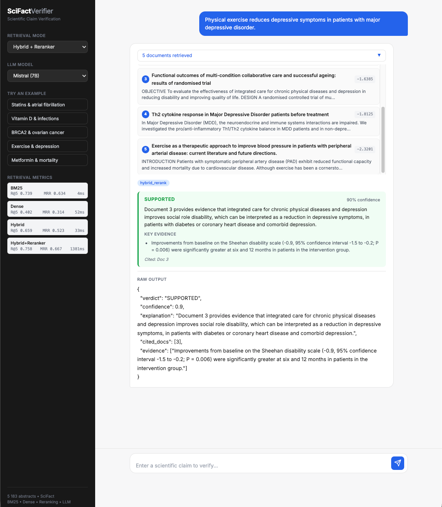

# SciFact RAG Verifier

A Flask-based retrieval-augmented generation application for scientific claim verification on the SciFact dataset.

Given a scientific claim, the system retrieves candidate biomedical abstracts, reranks the evidence, and asks a local LLM to return a structured verdict:

```text
SUPPORTED / REFUTED / NOT ENOUGH INFO
```



## Demo


## Architecture

```text
Claim
  -> BM25 retrieval
  -> SPECTER2 dense retrieval
  -> Reciprocal Rank Fusion
  -> Cross-encoder reranking
  -> Local LLM generation
  -> JSON verdict with cited evidence
```

The retrieval pipeline combines lexical matching and dense scientific embeddings before sending the top evidence candidates to the verifier model.

## Features

- BM25 retrieval over SciFact abstracts
- FAISS dense retrieval with SPECTER2 query/document adapters
- Reciprocal Rank Fusion for hybrid retrieval
- Cross-encoder reranking
- Local LLM generation through Ollama
- Structured JSON verdict output
- Flask web interface with streamed responses
- Retrieval evaluation on SciFact qrels
- LoRA fine-tuning path for the dense retriever

## Project Structure

```text
app/                         Flask app, routes, services, templates, static assets
src/data/                    SciFact loading and preprocessing
src/retrieval/               BM25, dense, hybrid, and reranked retrievers
src/rag/                     Prompting and LLM generator backends
src/evaluation/              Retrieval metrics and evaluation CLI
src/finetuning/retriever/    SPECTER2 retriever fine-tuning utilities
docker/training/             GPU training image files
scripts/ovh/                 OVH AI Training job scripts
data/                        Local datasets and generated indexes
reports/                     Generated evaluation reports
```

## Requirements

- Python 3.11+
- Ollama for local LLM inference
- Enough disk space for SciFact data, embedding models, and FAISS indexes

Install Python dependencies:

```bash
pip install -r requirements.txt
```

Install and start the default local LLM:

```bash
ollama pull mistral
ollama serve
```

## Configuration

Create a local `.env` file from the example:

```bash
cp .env.example .env
```

Core configuration:

```bash
OLLAMA_MODEL=mistral
OLLAMA_URL=http://localhost:11434

SPECTER2_BASE_MODEL=allenai/specter2_base
SPECTER2_QUERY_ADAPTER=allenai/specter2_adhoc_query
SPECTER2_DOCUMENT_ADAPTER=allenai/specter2
DENSE_INDEX_BATCH_SIZE=32
LLM_TOP_K=5

FLASK_PORT=5000
```

See `.env.example` for the full list of available options.

After fine-tuning a retriever LoRA adapter, add:

```bash
SPECTER2_LORA_ADAPTER=models/retriever/scifact-lora
```

Then rebuild the dense index.

## Build Indexes

Before running the application, build the BM25 and FAISS indexes:

```bash
python setup_indexes.py
```

If the SPECTER2 adapter, LoRA adapter, or tokenizer configuration changes, rebuild the indexes:

```bash
python setup_indexes.py --force
```

To rebuild only the dense FAISS index:

```bash
python setup_indexes.py --force-dense
```

## Run the Application

```bash
python run.py
```

Open:

```text
http://localhost:5000
```

## API

| Endpoint | Description |
|---|---|
| `/api/chat` | Retrieval plus streamed LLM generation |
| `/api/search` | Retrieval only |
| `/api/health` | Service health check |
| `/api/metrics` | Saved retrieval metrics |

## Evaluation

Evaluate the active application retrievers:

```bash
python -m src.evaluation \
  --split test \
  --top-k 10 \
  --output reports/retrieval_metrics_test.json
```

Current results on SciFact `qrels_test` with 300 test claims:

| Retriever | Recall@1 | Recall@5 | Recall@10 | P@5 | MRR | nDCG@10 | ms/query |
|---|---:|---:|---:|---:|---:|---:|---:|
| BM25 | 0.5244 | 0.7386 | 0.8112 | 0.1580 | 0.6341 | 0.6737 | 8.2 |
| Dense SPECTER2 | 0.5089 | 0.7155 | 0.7741 | 0.1560 | 0.6095 | 0.6455 | 30.4 |
| Hybrid | 0.5696 | 0.7812 | 0.8408 | 0.1693 | 0.6800 | 0.7149 | 41.5 |
| Hybrid + Reranker | 0.5519 | 0.7549 | 0.8196 | 0.1667 | 0.6607 | 0.6934 | 1240.0 |

The strongest retrieval configuration in this run is `Hybrid`. The cross-encoder reranker is substantially slower on CPU and does not improve aggregate test metrics with the current pretrained reranker.

## Dense Retriever Fine-Tuning

The project includes a LoRA fine-tuning workflow for the SPECTER2 dense retriever.

Prepare contrastive training examples:

```bash
python -m src.finetuning.retriever.prepare_data
```

Each example contains:

- a SciFact claim as query
- a positive abstract from qrels
- hard negatives mined from BM25 and SPECTER2 retrieval

The preparation step creates three files:

```text
data/processed/fine_tuning/retriever/train.jsonl
data/processed/fine_tuning/retriever/validation.jsonl
data/processed/fine_tuning/retriever/test.jsonl
```

`validation.jsonl` is created from the official SciFact train qrels. The official test qrels are kept only for final evaluation.

Train the LoRA adapter. Validation metrics are computed at the end of each epoch from `validation.jsonl`:

```bash
python -m src.finetuning.retriever.train_lora
```

The training script writes:

```text
models/retriever/scifact-lora/training_loss.jsonl
models/retriever/scifact-lora/validation_metrics.jsonl
```

### GPU Training on OVH

Build and push the training image for OVH AI Training:

```bash
docker buildx build \
  --platform linux/amd64 \
  --provenance=false \
  -f docker/training/Dockerfile \
  -t docker.io/nour474/scifact-retriever-train:lora \
  --push \
  .
```

The dataset archive must contain `data/processed/`, including the fine-tuning `train`, `validation`, and `test` JSONL files. The working object path is:

```text
scifact-retriever-data/datasets/scifact-retriever-data.tar.gz
```

Run the job on OVH:

```bash
RUN_NAME=scifact-lora-$(date +%Y%m%d-%H%M)
IMAGE=docker.io/nour474/scifact-retriever-train:lora
CONTAINER=scifact-retriever-data
DATASTORE=s3gra

ovhai job run \
  --name "$RUN_NAME" \
  --flavor ai1-le-1-gpu \
  --gpu 1 \
  --volume "$CONTAINER@$DATASTORE/datasets:/data:ro:cache" \
  --volume "$CONTAINER@$DATASTORE/runs/lora/$RUN_NAME:/workspace/run:rw" \
  --env DATA_ARCHIVE_PATH=/data/scifact-retriever-data.tar.gz \
  --env OUTPUT_DIR=/workspace/run/model/scifact-lora \
  --env REPORT_DIR=/workspace/run/reports \
  --env ARTIFACT_DIR=/workspace/run/artifacts \
  --env EPOCHS=3 \
  --env BATCH_SIZE=64 \
  --env EVAL_BATCH_SIZE=32 \
  --env FP16=true \
  --env REQUIRE_GPU=true \
  --env WANDB=true \
  --env WANDB_PROJECT=scifact-retriever \
  --env WANDB_RUN_NAME="$RUN_NAME" \
  --env WANDB_API_KEY="$WANDB_API_KEY" \
  "$IMAGE"
```

The job writes these files under `runs/lora/$RUN_NAME/` in Object Storage:

```text
model/scifact-lora/          LoRA adapter
reports/loss.jsonl           training loss log
reports/validation_metrics.jsonl
reports/eval_test.txt        test evaluation
artifacts/scifact-lora.tar.gz
artifacts/lora-reports.tar.gz
```

Evaluate the fine-tuned adapter:

```bash
python -m src.finetuning.retriever.evaluate \
  --lora-adapter models/retriever/scifact-lora \
  --split test
```

Use the adapter in the application:

```bash
SPECTER2_LORA_ADAPTER=models/retriever/scifact-lora
python setup_indexes.py --force
```

## Tests

Run the unit tests:

```bash
pytest -q
```

## Limitations

This project is a research and prototyping system, not a production-grade scientific fact-checker.

The LLM may confuse related evidence with direct support, especially when retrieved abstracts are only loosely connected to the claim. Retrieval evaluation uses SciFact qrels, so unjudged documents are treated as non-relevant.
